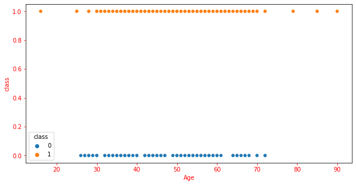

# Early-Stage-Diabetes-Risk

# Abstract
This project aims to select the best classifier algorithm than can predict whether someone has an early stage diabetes risk or not using an available public dataset.

# Data Understanding
* The data can be downloaded at 
  https://www.kaggle.com/datasets/ishandutta/early-stage-diabetes-risk-prediction-dataset
* The data was collected by questionnaires from the patients of Sylhet Diabetes Hospital in Sylhet, Bangladesh 
  and has been approved by a doctor
* It contains 17 columns, 16 of them are categorical columns with binary response and 1 "Age" column that consists a numerical value

# Exploratory Data Analysis
* There are no missing values nor duplicates found
* The categorical columns has been encoded accordingly

# Features Selection
* Chi-square method was used to analyse the significance of each categorical columns with respect to the diabetes class column
  | Features             | P-Value|
  | -------------        |:------:|
  | Gender               | 0.0    |
  | Polyuria             | 0.0    |
  | Polydipsia           | 0.0    |
  | Sudden Weight Loss   | 0.0    |
  | Weakness             | 0.002  |
  | Polyphagia           | 0.0    |
  | Genital Thrush       | 0.01   |
  | Visual Blurring      | 0.0002 |
  | Itching              | 0.7    |
  | Irritability         | 0.0    |
  | Delayed Healing      | 0.5    |
  | Partial Paresis      | 0.0    |
  | Muscle Stiffness     | 0.1    |
  | Alopecia             | 0.0    |
  | Obesity              | 0.25   | 
  
  | Features             | Chi2 Score|
  | -------------        |:------:   |
  | Gender               |  28.6     |
  | Polyuria             |  98.3     |
  | Polydipsia           |  100.8    |
  | Sudden Weight Loss   | 52.7      |
  | Weakness             | 9.4       |
  | Polyphagia           | 20.5      |
  | Genital Thrush       | 6.08      |
  | Visual Blurring      | 13.6      |
  | Itching              | 0.07      |
  | Irritability         | 29.2      |
  | Delayed Healing      | 0.36      |
  | Partial Paresis      | 41.8      |
  | Muscle Stiffness     | 2.6       |
  | Alopecia             | 18.4      |
  | Obesity              | 1.27      | 
 
* Seperate scatter plot to visualize age and diabetes class relationship
 

* "Itching", "Delayed Healing, "Muscle Stiffness", and "Obesity" chi-square scores close to zero indicates there is a high chance that those variables do not have any relationship with the target. Parallel to that, the high p-value explains the insignificant relationship if there is ever a relationship in the sample data. Thoes four variables and "Age" look like they can't provide a distinction between the positive and negative diabetic classes.

# Model Selection
  Three classifier models; Logistic Regression, K-Nearest Neighbors, and Random Forest; were examined using a ten-fold cross validation. 
  | Models              | Accuracy | Precision | Recall | F1    |
  | ---------------     | -------- | --------  | ------ | ----- |
  | K-Nearest Neighbors | 0.85     | 0.95      | 0.79   | 0.86  |
  | Logistic Regression | 0.91     | 0.95      | 0.91   | 0.93  |
  | Random Forest       | 0.97     | 0.98      | 0.98   | 0.98  |
  
  Random Forest has the best score in all front and especially far ahead in the "Recall" score, which is the most important metric because in the nature of disease prediction model, false negative is the priority to minimize.
 
 # Model Evaluation (Random Forest)
 The random forest classifier model was fit into the dataset first without feature selection and then with feature selection involved to compare the result. The elimination was based on the chi-squared result and the graph shown earlier
 
|      With All Features        |
| ---------------------------   |
| True Positive: 70             |
| True Negative: 33             |
| False Positive: 0             |
| False Negative: 1             |
| Precision: 1.0                |
| Recall: 0.98                  |
| F1-Score: 0.99                |
  
|    With Feature Selection     |
| ---------------------------   |
| True Positive: 69             |
| True Negative: 32             |
| False Positive: 1             |
| False Negative: 2             |
| Precision: 0.98               |
| Recall: 0.97                  |
| F1-Score: 0.97                |

The model that involves all features seem already performed super well. Perfect score in "Precision" with 0 False Positive predicted and only 1 False Negative prediction made from the test data. At this point it seemed unlikely to top that result but the feature selection was still applied in the next phase and evaluate against the same test data. The result showed, removing some features does not improve the "Recall" nor any other metrics.

# Conclusion
 * In this particular dataset, Random Forest is the best classifier algorithm beacuse it delivered the almost perfect result in all metrics, especially "Recall" which    normally be the priority aim for a disease predicton model. 
 * Feature selection method for this dataset and model is something to be assessed carefully for its further application
  
  
  
  
